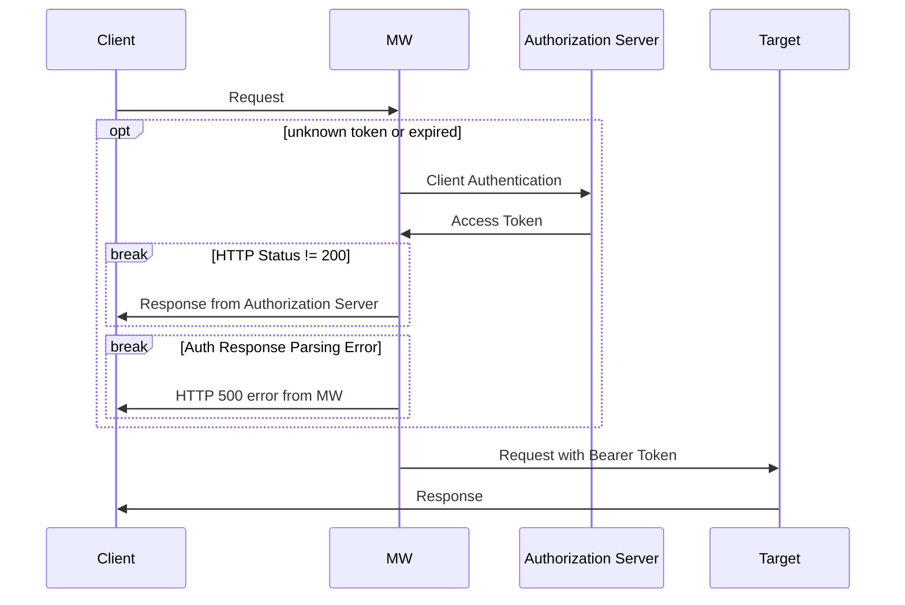

# Outgoing OAuth2 Client Credentials Traefik Plugin
This is a middleware plugin for [Traefik](https://traefik.io/) to authorize *outgoing* requests using [OAuth2 Client Credentials Flow](https://datatracker.ietf.org/doc/html/rfc6749#section-4.4). The main idea is to use this plugin for separation of concerns in front of an external target.

Install manually or from the [Traefik Plugin Catalog](https://plugins.traefik.io/plugins).

This fulfills the same goal as [Upstream OAuth](https://plugins.traefik.io/plugins/63cd79ab3cccb4a7200f6f54/upstream-o-auth). Apart from a different set of configuration options, this plugin does not have any dependencies beyond the Go standard library. The disadvantage is that the authorization implementation may be more brittle.

## Configuration

### Static
Enable the plugin in the Traefik Static configuration.
```yaml
experimental:
  plugins:
    outgoing-oauth2-cc:
      moduleName: github.com/isotes/traefik-outgoing-oauth2-cc
      version: v1.0.0
```

### Dynamic
Specify the necessary information for performing the Authorization Grant.

Credentials: if user/pass are specified, the 'Authorization' header is computed with the Basic Auth credentials. By default, both the user and password are first encoded with the 'application/x-www-form-urlencoded' algorithm before computing the Basic Auth header as specified in the RFC,. Since not all OAuth2 servers are compliant, it is possible to skip the encoding step by setting `basicAuthSkipEncoding: true`. Finally, is also possible to pre-compute the 'Authorization' header and set it directly in the `headers` section below. For this reason, the `user` and `pass` fields are optional.

```yaml
http:
  middlewares:
    example-outgoing-oauth2-cc:
      plugin:
        outgoing-oauth2-cc:
          trace: false  # optional: enable additional debugging (incl. the result of token requests)
          authGrantRequest:
            url: https://example.com/request-token
            user: foo  # optional: the user for basic auth; alternatively, use a pre-computed 'Authorization' header value
            pass: ~file~/secrets/password.txt  # the password (here: read from a file)
            scope: read  # optional: the access token scope
            expiresMarginSeconds: 10  # optional: the margin in seconds subtracted from the expires_in response
            basicAuthSkipEncoding: false  # optional: set to true to disable url-encoding of user/pass for non-RFC-compliant authorization servers
            headers:  # HTTP headers for the auth grant request
              - name: X-Bar
                value: ~base64~env~BAR_VALUE  # the value is read from an environment variable interpreted as base64
              - name: X-Info
                value: important
```

Configuration fields: the fields `user`, `pass`, `name`, and `value` provide some flexibility in how to specify the values. By default, the value is used directly as a string, unless it starts with `~`. Then the value is parsed as `~[<encoding>~]<source>~<value>`.
- `<encoding>` is optional and specifies the encoding of the value. Currently, only `base64` is supported (standard alphabet as well as URL alphabet).
- `<source>` is required and specifies the source of the value.
  - `~file~XYZ` reads the value from the file `XYZ`
  - `~env~XYZ` reads the value from the environment variable `XYZ`
  - `~direct~~XYZ` uses the value `~XYZ` directly (only required if the value starts with `~`)

## Behavior
The plugin has a simple logic: if a token is not known or has expired, a Client Authentication request is made to obtain an Access Token. If this is successful, the original request is modified by setting the 'Authorization' header to 'Bearer <token>' and continued; the token is kept in memory for later use.

If the Authorization Server does not return status code 200, that response is returned to the original client. If another issue occurs, e.g., while parsing the response of the Authentication Server, the plugin itself returns an HTTP 500 error. In both cases, the original request is not performed.

This plugin does not perform token refresh and instead always uses Client Authentication requests.


[Mermaid Live](https://mermaid.live/edit#pako:eNp9kk1rwzAMhv-K5nMHYbBLYIXuA3YJlDVQGLl4iZqaNFIm2-u20v8-O2mbMcJ8iGXrffXIdg6q5ApVqiy-e6QSH42uRbcFQRgPO4PkrufzbJ3CS1RYN2SGL3cOPDXEewLHDRKwAH52RrAaFHFk61Bh4d2WxXxrZ5hghfKBkp4AEJNhNmWfHZ1TplM3i7JEayGP1NHwJqgbeM7zJaycdt7C1R3cJMmouDQ0oOOxbMdkETbC7SRxNCNVf1nRMNZYarGGangSYfkH2nd4mySAUTigs_UEqA-GsC-Qa6nRXR4D9ibg71ELyu-7GGQTp1Qz1aK02lThzQ9RXKhw9y0WKg1hpaUpVEHHoNPe8eqLSpU68ThTwr7eqnSjdzasfFdpd_5bLrudplfm8_r4A3SHwZw

## License
[Apache 2.0](LICENSE)
